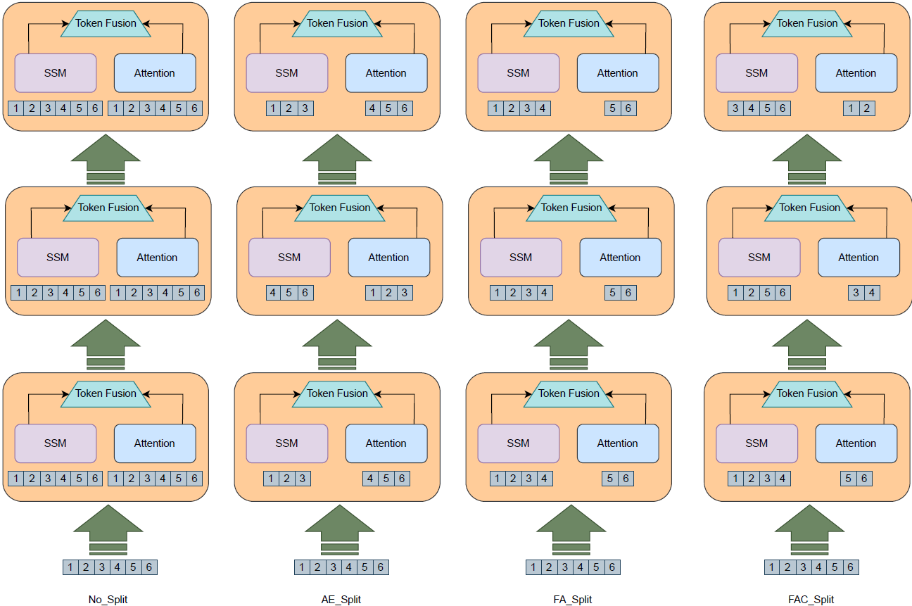
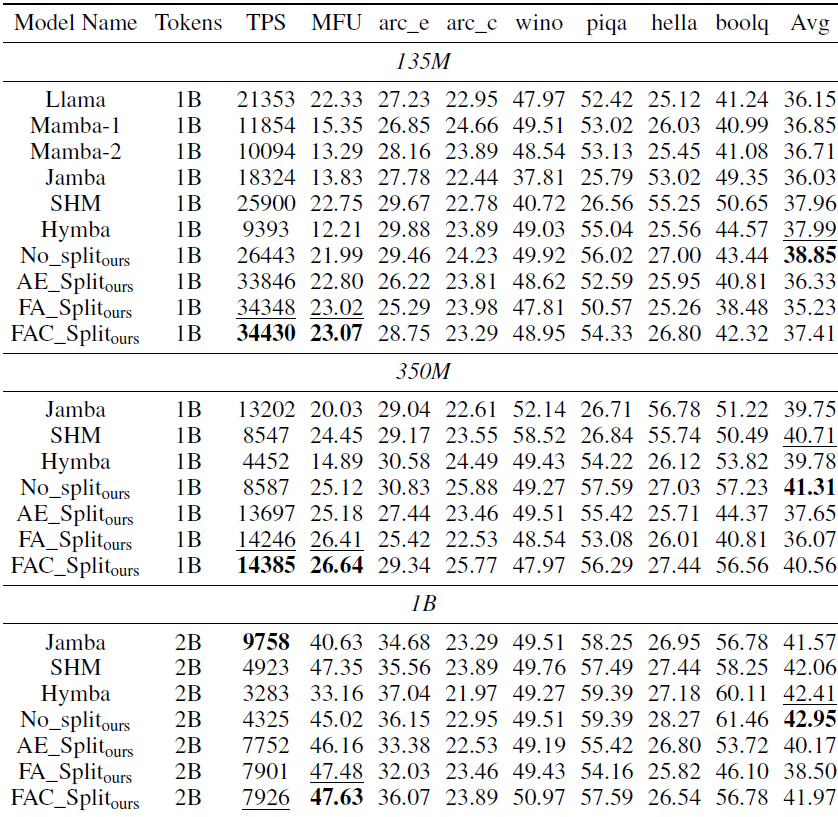
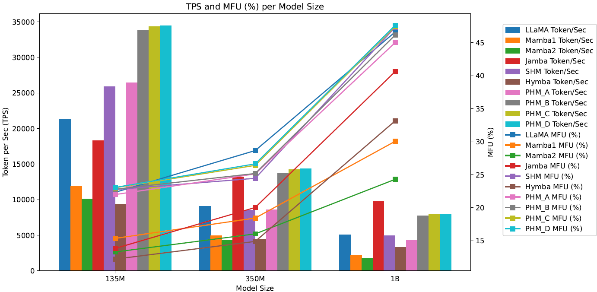

# 🚀 Balancing Computation Load and Representation Expressivity in Parallel Hybrid Neural Networks

 The code of our paper "Balancing Computation Load and Representation Expressivity in Parallel Hybrid Neural Networks"

## Overview

Attention and State-Space Models (SSMs) when combined in a hybrid network in sequence or in parallel provide complementary strengths. In a hybrid sequential pipeline they alternate between applying a transformer to the input and then feeding its output into a SSM. This results in idle periods in the individual components increasing end‐to‐end latency and lowering throughput caps. In the parallel hybrid architecture, the transformer operates independently in parallel with the SSM, and these pairs are cascaded,  with output from one pair forming the input to the next. Two issues are (i) creating an expressive knowledge representation with the inherently divergent outputs from these separate branches, and (ii) load balancing the computation between these parallel branches, while maintaining representation fidelity. In this work we present FlowHN, a novel parallel hybrid network architecture that accommodates various strategies for load balancing, achieved through appropriate distribution of input tokens between the two branches. Two innovative differentiating factors in FlowHN include a FLOP aware dynamic token split between the attention and SSM branches yielding efficient balance in compute load, and secondly, a method to fuse the highly divergent outputs from individual branches for enhancing representation expressivity. Together they enable much better token processing speeds, avoid bottlenecks, and at the same time yield significantly improved accuracy as compared to other competing works. We conduct comprehensive experiments on autoregressive language modeling for models with 135M, 350M, and 1B parameters. FlowHN outperforms sequential hybrid models and its parallel counterpart, achieving up to 4× higher Tokens per Second (TPS) and 2× better Model FLOPs Utilization (MFU).

Illustrative example of our four token-splitting strategies in action, showing how input tokens are partitioned and processed under each method.

## Results

 To assess the effectiveness of FlowHN, we benchmarked it against several state-of-the-art baselines—including LLaMA, Mamba-1, Mamba-2, Jamba, Sequential Hybrid Model (SHM), and Hymba—across three model scales: 135M, 350M, and 1B parameters. This table compares TPS, MFU, and accuracy across various state-of-the-art models, including our proposed FlowHN, evaluated at three model scales: 135M, 350M, and 1B parameters.

 
  The comparison graph of MFU and TPS between our proposed FlowHN and other SOTA.
